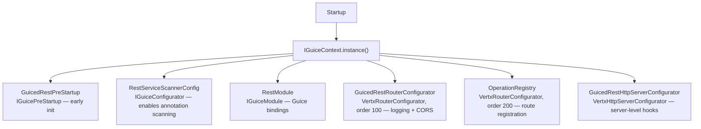
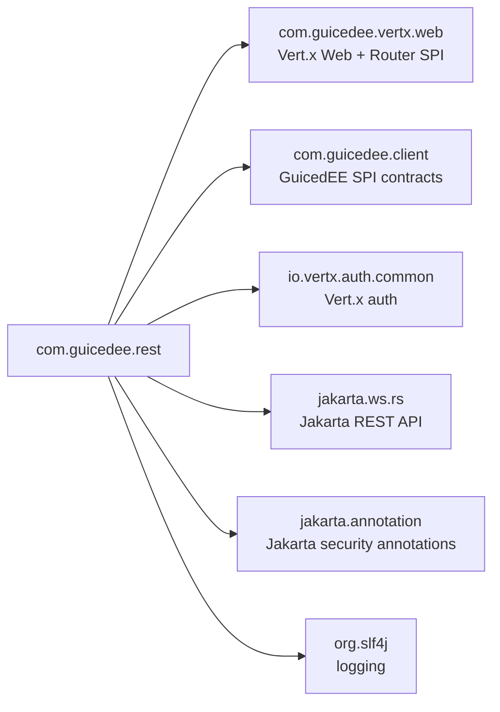

# GuicedEE REST Services

[](https://github.com/GuicedEE/GuicedRestServices/actions/workflows/build.yml)
[](https://central.sonatype.com/artifact/com.guicedee/rest)
[](https://github.com/GuicedEE/Packages/packages/maven/com.guicedee.rest)
[](https://www.apache.org/licenses/LICENSE-2.0)


Lightweight **Jakarta REST (JAX-RS) adapter for Vert.x 5** with full [GuicedEE](https://github.com/GuicedEE) integration.
Annotate your classes with standard `@Path`, `@GET`, `@POST`, etc. — routes are discovered at startup via ClassGraph and registered on the Vert.x `Router` automatically. Resource instances are created through Guice, so `@Inject` works everywhere.

Built on [Vert.x 5](https://vertx.io/) · [Jakarta REST](https://jakarta.ee/specifications/restful-ws/) · [Google Guice](https://github.com/google/guice) · JPMS module `com.guicedee.rest` · Java 25+

## 📦 Installation

```xml
<dependency>
  <groupId>com.guicedee</groupId>
  <artifactId>rest</artifactId>
</dependency>
```

<details>
<summary>Gradle (Kotlin DSL)</summary>

```kotlin
implementation("com.guicedee:rest:2.0.0-RC11")
```
</details>

## ✨ Features

- **Zero-config route registration** — `OperationRegistry` scans for `@Path`-annotated classes and maps them to Vert.x routes at startup
- **Jakarta REST annotations** — `@Path`, `@GET`, `@POST`, `@PUT`, `@DELETE`, `@PATCH`, `@HEAD`, `@OPTIONS`, `@Produces`, `@Consumes`
- **Parameter binding** — `@PathParam`, `@QueryParam`, `@HeaderParam`, `@CookieParam`, `@FormParam`, `@MatrixParam`, `@BeanParam`
- **Guice-managed resources** — resource classes are obtained from the Guice injector, so `@Inject` just works
- **Reactive support** — methods can return `Uni<T>`, `Future<T>`, or plain values; reactive types run on the event loop, blocking methods are dispatched to a worker pool
- **`@Verticle` worker pools** — resource classes in `@Verticle`-annotated packages automatically use their named worker pool
- **CORS** — annotation-driven (`@Cors`) or environment-variable-driven CORS handler configuration
- **Security** — `@RolesAllowed`, `@PermitAll`, `@DenyAll` with pluggable `AuthenticationHandler` and `AuthorizationProvider`
- **Exception mapping** — `jakarta.ws.rs.ext.ExceptionMapper` SPI + built-in status-code mapping with cause-chain traversal
- **JAX-RS `Response` support** — return `jakarta.ws.rs.core.Response` for full control over status, headers, and entity
- **Jackson serialization** — request/response bodies are (de)serialized with Jackson via Vert.x JSON; configurable via the `DefaultObjectMapper` binding
- **`RestInterceptor` SPI** — hook into request start/end for logging, metrics, or cross-cutting concerns

## 🚀 Quick Start

**Step 1** — Annotate a class with Jakarta REST annotations:

```java
@Path("/hello")
public class HelloResource {

    @GET
    @Produces(MediaType.APPLICATION_JSON)
    public String hello() {
        return "Hello, world!";
    }
}
```

**Step 2** — Bootstrap GuicedEE (routes are discovered and registered automatically):

```java
IGuiceContext.registerModuleForScanning.add("my.app");
IGuiceContext.instance();
```

That's it. `OperationRegistry` discovers `HelloResource`, registers `GET /hello` on the Vert.x router, and the endpoint is live.

## 📐 Architecture



### Request lifecycle

```
HTTP Request
 → Vert.x Router
   → CORS handler (if configured)
   → SecurityHandler (authentication + authorization check)
   → OperationRegistry.handleRequest()
     → vertx.runOnContext()                       ← event-loop dispatch
       → ParameterExtractor.extractParameters()   ← bind @PathParam, @QueryParam, body, etc.
       → GuiceRestInjectionProvider.getInstance()  ← Guice-managed resource instance
       → method.invoke(instance, params)           ← invoke the resource method
       → ResponseHandler.processResponse()         ← Uni / Future / Response / sync result
     → ResponseHandler.handleException()           ← on failure (ExceptionStatusMapper)
```

Execution is dispatched via `vertx.runOnContext()` to ensure the method runs on the Vert.x event-loop thread, keeping context-local state (e.g. Hibernate Reactive sessions, Mutiny subscriptions) properly associated with the current request.

## 🛣️ Paths

Class-level `@Path` is combined with method-level `@Path`:

```java
@Path("/api")
public class UsersResource {

    @GET
    @Path("/users/{id}")
    public User getUser(@PathParam("id") Long id) {
        return userService.find(id);
    }
}
```

```
GET /api/users/42
```

`@ApplicationPath` is also respected and prepended to `@Path`.

Path parameters use Jakarta REST `{param}` syntax — they are automatically converted to Vert.x `:param` style at registration time.

## 🔧 Parameter Binding

| Annotation | Source | Example |
|---|---|---|
| `@PathParam` | URL path segment | `@PathParam("id") Long id` |
| `@QueryParam` | Query string | `@QueryParam("page") int page` |
| `@HeaderParam` | HTTP header | `@HeaderParam("Authorization") String auth` |
| `@CookieParam` | Cookie value | `@CookieParam("session") String session` |
| `@FormParam` | Form field | `@FormParam("username") String user` |
| `@MatrixParam` | Matrix parameter | `@MatrixParam("color") String color` |
| `@BeanParam` | Composite bean | `@BeanParam SearchCriteria criteria` |
| *(none)* | Request body | Deserialized via Jackson |

### Type conversion

All primitive types, boxed types, enums, `UUID`, `BigDecimal`, `BigInteger`, `LocalDate`, `LocalDateTime`, `LocalTime`, `OffsetDateTime`, `ZonedDateTime`, and `Instant` are converted automatically from string values.

For unknown types, the JAX-RS §3.2 fallback chain applies:

1. `static valueOf(String)`
2. `static fromString(String)`
3. Single-`String` constructor

Complex body parameters are deserialized using the configured Jackson `ObjectMapper` (bound as `DefaultObjectMapper` in Guice).

### `RoutingContext` injection

If a method parameter is typed as `RoutingContext`, the current Vert.x routing context is injected directly:

```java
@POST
@Path("/upload")
public String upload(RoutingContext ctx) {
    return ctx.fileUploads().toString();
}
```

## ⚡ Reactive & Blocking

Methods returning `Uni<T>` or `Future<T>` are treated as **non-blocking** and run on the event loop:

```java
@GET
@Path("/reactive")
public Uni<List<Item>> listItems() {
    return itemRepository.listAll();
}
```

All other methods are treated as **blocking** and dispatched via `vertx.executeBlocking()`:

```java
@GET
@Path("/blocking")
public List<Item> listItemsBlocking() {
    return itemRepository.listAllSync();
}
```

### `@Verticle` worker pools

If the resource class belongs to a package annotated with `@Verticle` that defines a named worker pool, blocking work is dispatched to that pool instead of the default:

```java
@Verticle(workerPoolName = "rest-pool", workerPoolSize = 16, worker = true)
package com.example.api;
```

All `@Verticle` are named, although their name goes into `workerPoolName`.

## 📤 Response Handling

### Content type

The `@Produces` annotation determines the response `Content-Type`. When absent, `application/json` is the default.

### Response types

| Return type | Behavior |
|---|---|
| `null` / `void` | 204 No Content |
| `String` (text/plain) | Written as UTF-8 text |
| Any object (JSON) | Serialized via `Json.encodeToBuffer()` (Jackson) |
| `byte[]` | Written directly as `application/octet-stream` |
| `jakarta.ws.rs.core.Response` | Status, headers, and entity are applied directly |
| `Uni<T>` | Subscribed per-request; cancelled on client disconnect |
| `Future<T>` | Completed per-request; discarded on client disconnect |

### JAX-RS `Response` builder

Return a `Response` for full control:

```java
@POST
@Path("/items")
@Produces(MediaType.APPLICATION_JSON)
public Response createItem(Item item) {
    Item created = itemService.create(item);
    return Response.status(201)
                   .header("Location", "/items/" + created.getId())
                   .entity(created)
                   .build();
}
```

## 🔒 Security

### Jakarta security annotations

| Annotation | Effect |
|---|---|
| `@RolesAllowed("admin")` | Requires authentication + role check |
| `@PermitAll` | No authentication required |
| `@DenyAll` | Always returns 403 |

Annotations are checked at **method level first**, then **class level**.

```java
@Path("/admin")
@RolesAllowed("admin")
public class AdminResource {

    @GET
    @Path("/dashboard")
    public String dashboard() {
        return "admin-only";
    }

    @GET
    @Path("/public")
    @PermitAll
    public String publicEndpoint() {
        return "everyone";
    }
}
```

### Pluggable authentication & authorization

Register a default `AuthenticationHandler` and/or `AuthorizationProvider`:

```java
SecurityHandler.setDefaultAuthenticationHandler(myAuthHandler);
SecurityHandler.setDefaultAuthorizationProvider(myAuthProvider);
```

When a secured endpoint is hit:
1. If no authenticated user is present → **401 Unauthorized**
2. If the user doesn't have the required role → **403 Forbidden**

## 🌐 CORS

### `@Cors` annotation

Apply `@Cors` at the class or method level:

```java
@Path("/api")
@Cors(
    allowedOrigins = {"https://example.com"},
    allowedMethods = {"GET", "POST"},
    allowCredentials = true,
    maxAgeSeconds = 3600
)
public class ApiResource { ... }
```

| Attribute | Default | Purpose |
|---|---|---|
| `allowedOrigins` | `*` | Allowed origin patterns |
| `allowedMethods` | `GET, POST, PUT, DELETE, PATCH, OPTIONS` | Allowed HTTP methods |
| `allowedHeaders` | Common REST headers | Allowed request headers |
| `allowCredentials` | `true` | Whether credentials are allowed |
| `maxAgeSeconds` | `3600` | Preflight cache duration |
| `enabled` | `true` | Enable/disable CORS |

### Environment variable overrides

All `@Cors` attributes can be overridden without code changes:

| Variable | Purpose |
|---|---|
| `REST_CORS_ENABLED` | Enable/disable CORS globally |
| `REST_CORS_ALLOWED_ORIGINS` | Override allowed origins |
| `REST_CORS_ALLOWED_METHODS` | Override allowed methods |
| `REST_CORS_ALLOWED_HEADERS` | Override allowed headers |
| `REST_CORS_ALLOW_CREDENTIALS` | Override credentials flag |
| `REST_CORS_MAX_AGE` | Override max age seconds |

## ❌ Exception Handling

### Built-in status mapping

| Exception | Status |
|---|---|
| `IllegalArgumentException` | 400 |
| `IllegalStateException` | 400 |
| `SecurityException` | 403 |
| `NoResultException` (JPA) | 404 |
| `WebApplicationException` | Uses embedded status |
| `NullPointerException` | 500 |
| Other `RuntimeException` | 500 |

### `ExceptionMapper` SPI

Register custom exception mappers via `ServiceLoader` / JPMS `provides`:

```java
public class CustomExceptionMapper implements ExceptionMapper<CustomException> {
    @Override
    public Response toResponse(CustomException e) {
        return Response.status(422)
                       .entity(Map.of("error", e.getMessage()))
                       .build();
    }
}
```

```java
module my.app {
    provides jakarta.ws.rs.ext.ExceptionMapper
        with my.app.CustomExceptionMapper;
}
```

### Cause-chain traversal

When an exception yields a generic 500 status, `ExceptionStatusMapper` walks the cause chain to find a more specific mapping — for example, a `NoResultException` wrapped inside a `CompletionException` still maps to 404.

## 🔌 SPI & Extension Points

| SPI | Purpose |
|---|---|
| `VertxRouterConfigurator` | Customize the Vert.x `Router` (CORS, logging, etc.) |
| `VertxHttpServerConfigurator` | Customize the Vert.x `HttpServer` |
| `VertxHttpServerOptionsConfigurator` | Customize `HttpServerOptions` |
| `jakarta.ws.rs.ext.ExceptionMapper` | Map exceptions to HTTP responses |
| `RestInterceptor` | Hook into request start/end lifecycle |
| `IGuiceConfigurator` | Configure classpath scanning |
| `IGuiceModule` | Contribute Guice bindings |
| `IGuicePreStartup` | Run logic before route registration |

## 💉 Dependency Injection

Resource classes are obtained via `IGuiceContext.get(Class)`, so standard Guice injection works:

```java
@Path("/orders")
public class OrderResource {

    private final OrderService orderService;

    @Inject
    public OrderResource(OrderService orderService) {
        this.orderService = orderService;
    }

    @GET
    @Path("/{id}")
    @Produces(MediaType.APPLICATION_JSON)
    public Order getOrder(@PathParam("id") Long id) {
        return orderService.findById(id);
    }
}
```

## 🗺️ Module Graph



## 🧩 JPMS

Module name: **`com.guicedee.rest`**

The module:
- **exports** `com.guicedee.guicedservlets.rest.services`, `com.guicedee.guicedservlets.rest.pathing`, `com.guicedee.guicedservlets.rest.implementations`
- **provides** `IGuiceConfigurator`, `IGuicePreStartup`, `IGuiceModule`, `IPackageRejectListScanner`, `VertxRouterConfigurator`, `VertxHttpServerConfigurator`
- **uses** `VertxRouterConfigurator`, `VertxHttpServerConfigurator`, `VertxHttpServerOptionsConfigurator`, `ExceptionMapper`, `RestInterceptor`

## 🏗️ Key Classes

| Class | Package | Role |
|---|---|---|
| `OperationRegistry` | `pathing` | Discovers `@Path` classes and registers Vert.x routes |
| `JakartaWsScanner` | `pathing` | ClassGraph-based scanner for Jakarta REST resources |
| `PathHandler` | `pathing` | Resolves `@ApplicationPath` + `@Path` into full route paths |
| `HttpMethodHandler` | `pathing` | Maps Jakarta HTTP annotations to Vert.x `HttpMethod` |
| `ParameterExtractor` | `pathing` | Extracts and converts method parameters from the request |
| `ResponseHandler` | `pathing` | Converts method results (sync, `Uni`, `Future`, `Response`) into HTTP responses |
| `EventLoopHandler` | `pathing` | Dispatches blocking vs. reactive methods to the correct thread |
| `SecurityHandler` | `pathing` | Evaluates `@RolesAllowed`, `@PermitAll`, `@DenyAll` |
| `ExceptionStatusMapper` | `pathing` | Maps exceptions to HTTP status codes |
| `CorsHandlerConfigurator` | `implementations` | Configures Vert.x CORS handlers from `@Cors` and env vars |
| `GuicedRestRouterConfigurator` | `implementations` | Wires logging and CORS onto the router |
| `GuicedRestHttpServerConfigurator` | `implementations` | HTTP server-level customizations |
| `RestServiceScannerConfig` | `implementations` | Enables rich ClassGraph scanning for REST discovery |
| `RestModule` | `implementations` | Guice module for REST bindings |
| `GuiceRestInjectionProvider` | `services` | Provides Guice-backed resource instances |
| `GuicedRestPreStartup` | `services` | Pre-startup lifecycle hook |
| `RestInterceptor` | `services` | SPI for request start/end interception |
| `Cors` | `services` | Annotation for CORS configuration |

## 🤝 Contributing

Issues and pull requests are welcome — please add tests for new parameter types, response writers, or security features.

## 📄 License

[Apache 2.0](https://www.apache.org/licenses/LICENSE-2.0)
